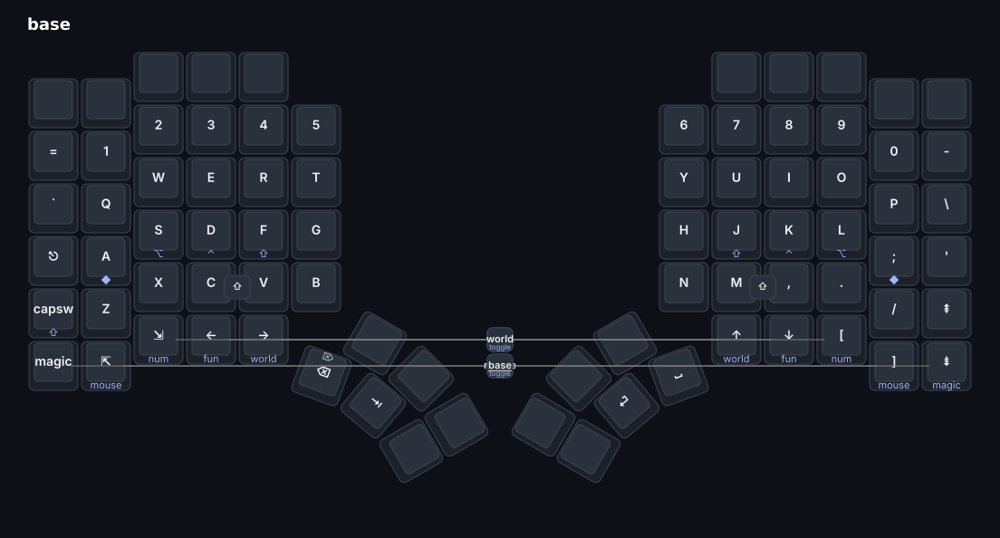
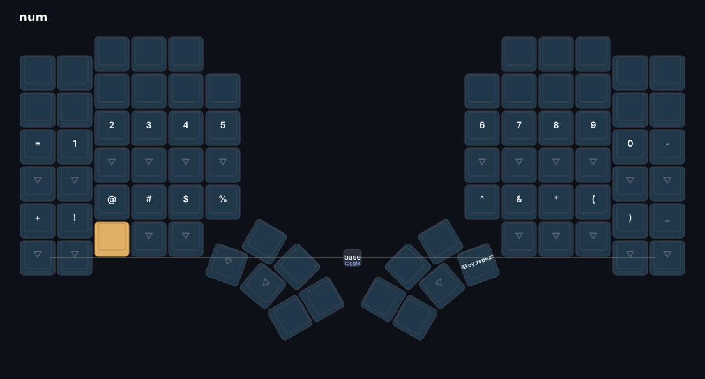
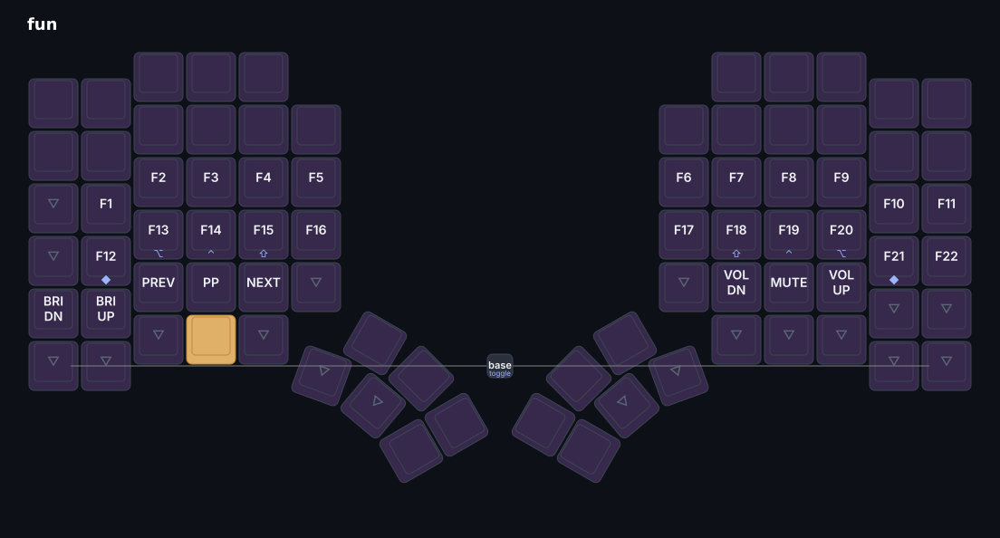
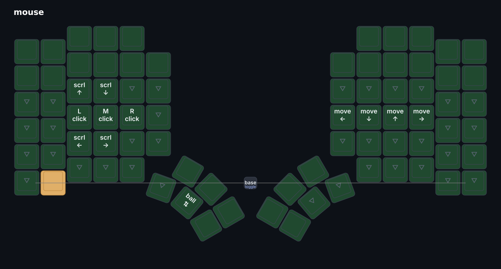
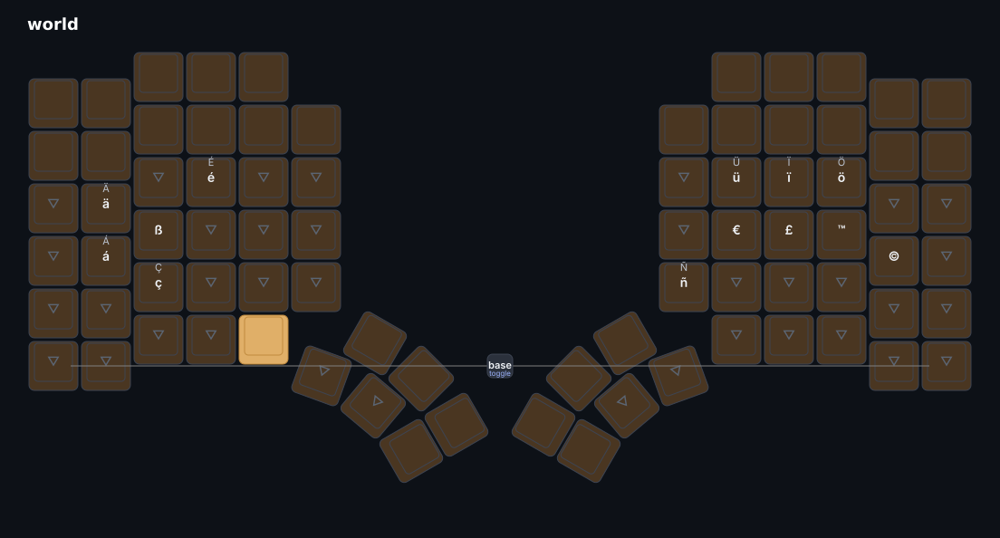
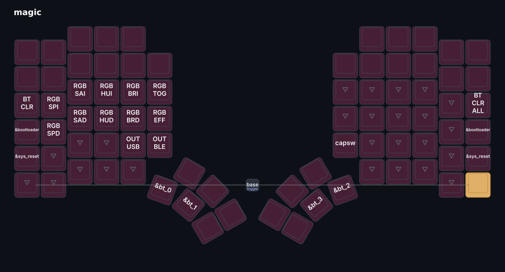

# Peter's Glove80 keymap

A custom QWERTY ZMK keymap for the [MoErgo Glove80](https://www.moergo.com/), built
**locally** with MoErgo's Nix toolchain (no Layout Editor). Forked from
[`moergo-sc/glove80-zmk-config`](https://github.com/moergo-sc/glove80-zmk-config).

Source of truth: [`config/glove80.keymap`](config/glove80.keymap) +
[`config/glove80.conf`](config/glove80.conf). The layer images below are generated from
that keymap with `./make-images.sh` (one-sheet PDF via `./make-pdf.sh`).

## Layer maps

### Base

### Num

### Fun

### Mouse

### World

### Magic


## Design

- **QWERTY**, rows **R2–R6** (R2 = number row), thumbs **T4/T5**; the F-row (R1) and the
  other thumbs are `&none`.
- **Timerless home-row mods** (urob-style: `balanced` + `require-prior-idle` + bilateral
  `hold-trigger-key-positions`): left `A`/`S`/`D`/`F` = GUI/Alt/Ctrl/Shift, right
  `J`/`K`/`L`/`;` = the right-side equivalents.
- **Chord-Shift** — hold **C+V** (left) or **M+`,`** (right) for Shift. It's *not* an HRM,
  so it isn't gated by `require-prior-idle` and works right after fast typing — e.g.
  `?` = hold C+V, tap `/`. This covers the one case HRMs can't (Shift mid-stream).
- **Pinky** — tap = **Caps Word**, hold = **Shift** (a second non-timing-gated Shift).
- **Symmetric, timerless bottom-row layers** — each half's R6, outer→inner, holds
  `magic · mouse · num · fun · world`. Plain tap = the nav key (arrows/Home/End/`[`/`]`/PgDn),
  **tap-then-hold repeats** it, hold = the layer.
- **Layer lock** — press *both halves'* keys for a layer to switch-and-stay (`&to`); press
  *both Magic keys* to unlock back to base.
- **Thumbs** — left = Backspace (Shift→Delete) / Tab, right = Space / Return. All repeat on hold.
- `` ` ``/`~` left of Q; Esc on the left outer column.

### Layers

| # | Layer | reach | contents |
|---|-------|-------|----------|
| 0 | BASE | default | QWERTY + home-row mods + nav/bracket R6 |
| 1 | NUM | hold `num` (C4) | digits on the top row, `=`/`+` outer; shifted-number symbol row (`+ ! @ # $ %` / `^ & * ( ) _`) below |
| 2 | FUN | hold `fun` (C3) | **F1–F22** (left outer column reserved for brightness-down) + media; home-row mods live here too |
| 3 | MOUSE | hold `mouse` (C5) | left: clicks + scroll + **scroll-ball**; right: pointer move (hjkl) |
| 4 | WORLD | hold `world` (C2) | Compose accents/symbols: ä Ä é É ü Ü ö ç ñ ß € £ ™ © |
| 5 | MAGIC | hold `magic` (C6) | RGB underglow, Bluetooth profiles/clear, USB/BLE output, `&bootloader`, `&sys_reset`, Caps Word |

Requires `CONFIG_ZMK_POINTING=y` (in `config/glove80.conf`) for the mouse layer.

### Combos

- **C+V** / **M+`,`** → Shift (held while the chord is held).
- both-`num` / both-`fun` / both-`mouse` / both-`world` → **lock** that layer; both-`magic` → **unlock**.

## Build

Needs Docker (the build runs MoErgo's Nix toolchain in a container; uses their cachix).

```sh
./build.sh main        # → ./glove80.uf2  (combined LH+RH; firmware branch "main")
```

`glove80.uf2` is git-ignored — it's a build artifact.

## Flash

Flash **each half separately** with the same combined `glove80.uf2`:

1. Slide a half's power switch **off**, then **on while holding `C6R6 + C3R3`** (the
   bootloader reads the raw matrix, so this works regardless of keymap). The red LED
   slow-pulses and the half mounts as `GLV80LHBOOT` / `GLV80RHBOOT`.
2. Copy `glove80.uf2` onto it (`cp glove80.uf2 /run/media/$USER/GLV80LHBOOT/`). It
   unmounts itself when done.
3. Repeat for the other half. After enabling pointing, re-pair Bluetooth (the HID
   descriptor changed).

From working firmware you can also use **Magic + Esc** (left) / **Magic + '** (right).

> **Recovery:** the power-on `C6R6 + C3R3` combo is keymap-independent, so a bad keymap
> can never block reflashing. Factory/settings-reset images from MoErgo flash the same way.

## Diagrams

```sh
./make-images.sh       # → images/*.png   (one per layer; used in this README)
./make-pdf.sh          # → glove80.svg + glove80.pdf  (all layers on one sheet)
```

Need `keymap-drawer` (`pipx install keymap-drawer`) and `inkscape`. Theme/labels live in
[`kd_config.yaml`](kd_config.yaml).

## Host integration (not in this repo)

Two pieces live in the dotfiles repo (`~`), not here:

- **Trackball scroll-ball** — on the MOUSE layer, the left-thumb `SBALL` key sends `Pause`.
  A Sway bind (`bindsym Pause … / --release Pause …`) signals the `shift-hscroll.py`
  systemd user service (`SIGUSR1`/`SIGUSR2`) to toggle a scroll mode that maps the MX Ergo's
  ball motion to 2-axis scrolling. `Pause` is inert and carries no modifiers (a held
  Ctrl/Shift would corrupt scrolling).
- **WORLD Compose key** — Sway sets `xkb_options "caps:escape,compose:menu"`; the WORLD
  macros emit `K_APP` (Menu) as the Compose key.
